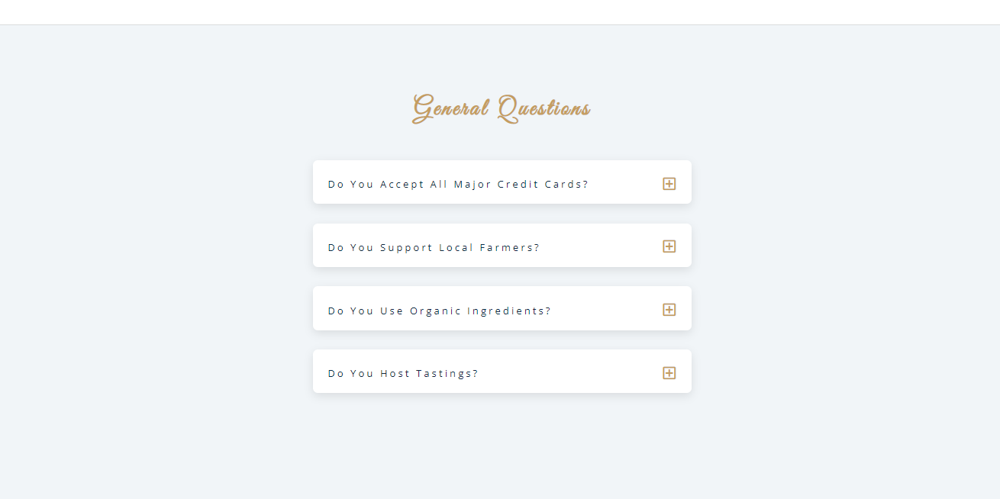
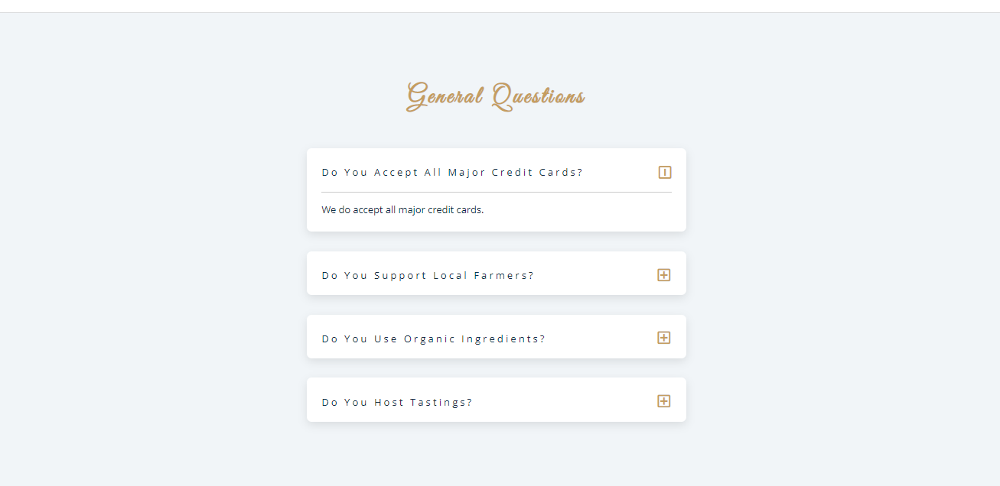
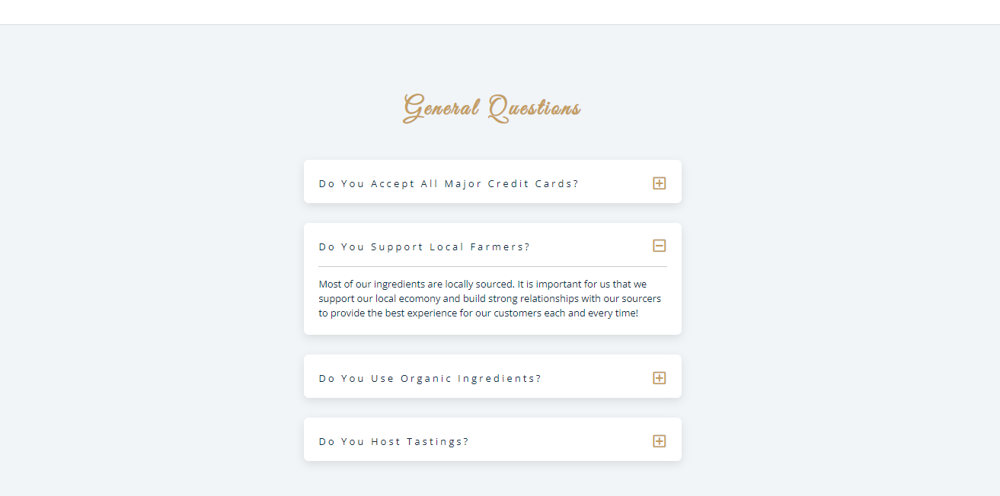

<h1>Dynamic FAQs Project</h1>

<h2>Description</h2>
Project consists of JavaScript, Toggle Functions, querySelector Functions, and Event Listeners! The purpose of this method is to target the actual buttons, so that when one activated, the other drop down boxes receed! This leads to a clean and crisp user experience for the user.  This skill set is put into practice in the form of a FAQ page that you may see on a restaurant webpage!
 

<h2>Languages and Utilities Used</h2>

- <b>JavaScript, CSS, HTML</b> 
- <b>GitHub, Images</b>

<h2>Environments Used </h2>

- <b>Windows 10</b> (21H2)

<h2>Program walk-through:</h2>

Home Page:  
   

 
 
Click a question, and the response will seamlessly appear.   
   

 
 
Click a different button, and That response will appear. The initial response receeds, creating a smooth clean look and avoiding distractions for the user!  
   

 
 

